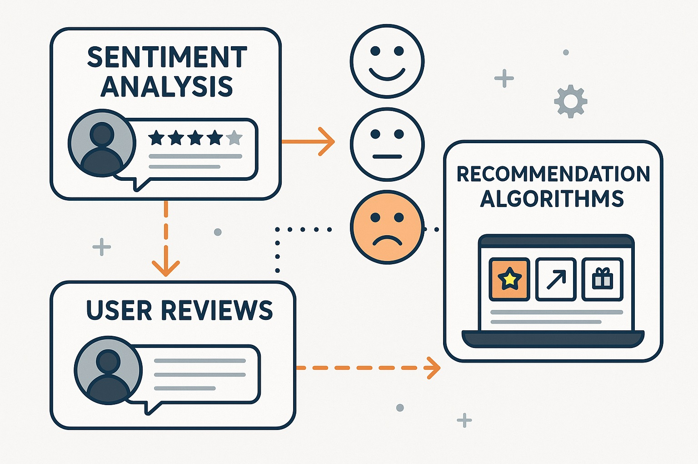

# Data Engineer (AI/ML)

---

## 🧠 Natural Language Processing

### 🔹 Sentiment-Based Product Recommendation

**Ebuss**, a fast-growing e-commerce company, is competing with market leaders like Amazon and Flipkart. It offers a wide range of products— from household essentials to healthcare— and aims to scale rapidly through AI-powered solutions like sentiment-based product recommendations.

  

---

## 🌱 Computer Vision

### 🔹 Seedlings Classification

This project demonstrates the use of AI and Deep Learning in agriculture by automating plant and weed classification. Such innovations help reduce manual labor, improve crop yields, and support sustainable farming practices.

  

