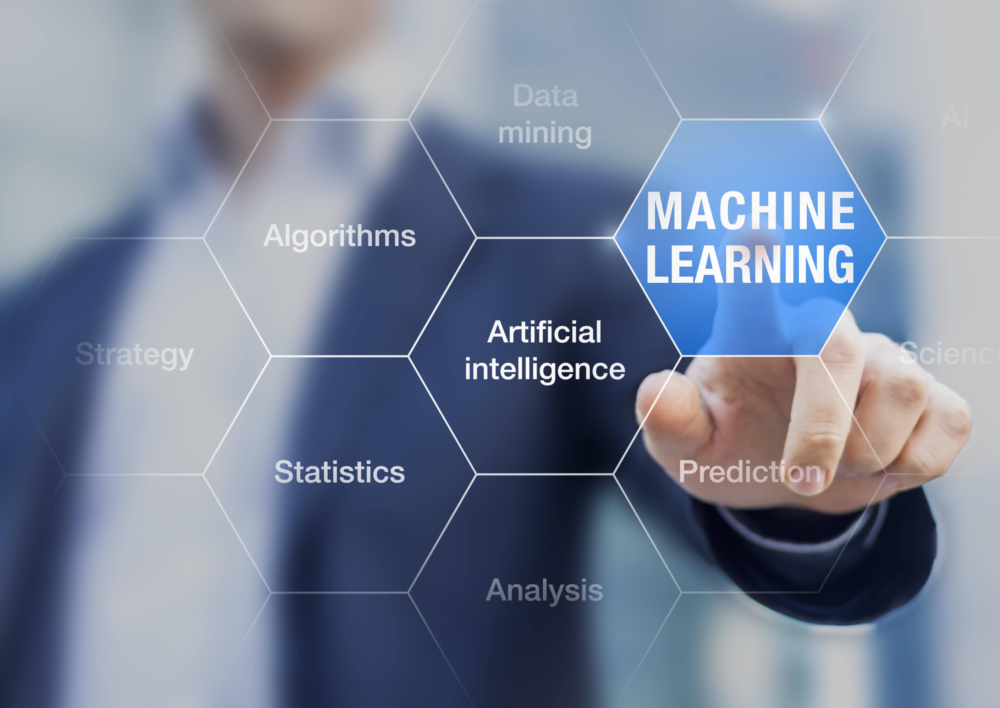

# Data Engineer (AI/ML)
---
## Natural Language Processing

### Sentiment Based Product Recommendation

Ebuss, a growing e-commerce company competing with giants like Amazon and Flipkart, sells a wide range of products online— from household essentials to healthcare—aiming to expand rapidly in the digital marketplace.

---
### Seedlings_Classification_Computer_Vision

This is just a collection of topics and algorithms that in my opinion are interesting.

AI and Deep Learning can revolutionize agriculture by automating plant and weed identification, reducing manual labor, improving crop yields, and promoting sustainable farming practices.

